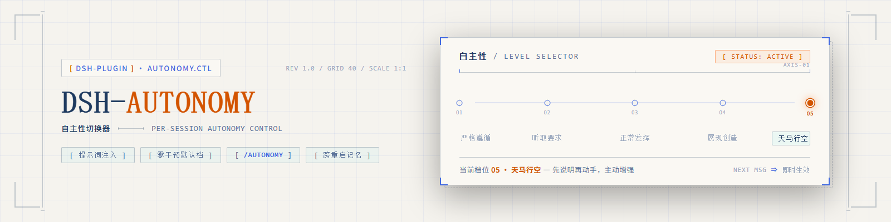

# dsh-autonomy — DSH 自主性切换器



一个为 [DeepSeek Harness](https://github.com/deepseek-ai/DeepSeek-Harness) 打造的轻量插件：
在输入框工具行（模型切换器左侧）提供一个**五档自主性滑块**，按会话调节模型的自主性与创造力，
从「严格遵循」到「天马行空」。

---

## 痛点：为什么需要这个插件

DSH 的模型默认自主性极强：拿到一句话请求，它会在**单轮对话内**主动调用大量工具、执行长链路任务、
自主扩展工作范围。这通常是优点，但有时恰恰是问题：

- **只想加一个小功能**，模型却顺手重构了相邻代码、改了无关文件、跑了多余命令——大动干戈；
- **只想问一个问题**，模型却把整个仓库翻了个底朝天，然后给你一份十步实施方案；
- 反过来，需要模型**大胆发挥**（头脑风暴、自主探索、主动补全）时，又没有任何手段放开它的手脚；
- DSH 现有的模型选择器只提供 provider / model / 推理等级（effort），**没有任何"行为档位"**；
- 即使有全局设置，不同会话也需要不同的自主性——**讨论的会话要保守，干活的会话要放开**。

**本插件解决的就是这个空白**：一个随时可调、每会话独立记忆、下一条消息立即生效的自主性档位。

## 功能特性

- **五档滑块**：严格遵循 → 听取要求 → 正常发挥 → 展现创造 → 天马行空，创造力与自主性依次递增；
- **每会话独立**：档位写入会话事件日志，跨会话互不影响，**重启后依然保留**；
- **即时生效**：拖动滑块后**下一条消息**即按新档位行为，无需重启、无需新会话；
- **零干预默认档**：「正常发挥」不注入任何提示词，行为与未安装插件完全一致；
- **可键盘操作**：聚焦轨道后 ← / → 键切换档位；
- **命令行支持**：`/autonomy` 命令（见下文），可编程切换、查看、重置。

### 五档行为速览

| 档位 | 模型的行为约定 |
|---|---|
| 严格遵循 | 只做字面请求；不加步骤/工具/文件/交付物；歧义即停问；工具调用最小化 |
| 听取要求 | 忠实执行请求范围；仅允许必要支撑步骤（如编辑前读文件）；不做请求外的重构/加功能 |
| 正常发挥 | 零干预，DSH 出厂行为 |
| 展现创造 | 在请求范围内主动：指出改进点/替代方案/风险；适度额外工作并说明 |
| 天马行空 | 追求意图而非字面；**动手前先一句话说明意图**；主动添加用户未提及、但提升体验且符合需求的功能；自由探索多路线；完成后列出新增项与理由 |

---

## 安装

### 环境要求

- DeepSeek Harness **rc.6 及以上**（web 部署）；
- Windows（脚本基于 PowerShell；macOS/Linux 可手动执行等价步骤）。

### 方式一：手动安装

```powershell
# 1. 克隆仓库
git clone https://github.com/abab996/dsh-autonomy.git dsh-autonomy
cd dsh-autonomy

# 2. 安装依赖（构建 client bundle 需要）
npm install

# 3. 部署：构建两包 → 装入 web profile → 启用插件行 → 注册 settings 白名单
#    在普通 PowerShell 中运行（需要能写入 ~/.dsh 与 DSH 安装目录）
powershell -ExecutionPolicy Bypass -File deploy.ps1
```

部署脚本幂等，完成三件事：

1. 构建两个包（client 包打成 DSH 的 `window.__ModuleLoader__` 手接格式）；
2. 以本地 `file:` 依赖（junction 软链）装入 `~/.dsh/profiles/web`——之后改代码只需重新构建，无需卸载重装；
3. 在 profile 的 `cordis.patch.yml` 追加启用行，并把 `autonomy` 加入 `dsh-host-apiproxy` 的
   `WEB_SETTINGS_NAMESPACES` 白名单（DSH 升级后需重跑本脚本）。

### 方式二：让 AI 帮你安装（推荐）

不想敲命令？直接在 DSH 中新建一个会话，把下面这段提示词整段复制发给 AI 即可，
AI 会自己完成克隆、装依赖、跑部署脚本并验证结果（你只需要在最后重启一次 DSH）：

````text
请帮我安装这个 DSH 插件仓库：https://github.com/abab996/dsh-autonomy

请按以下步骤操作，每完成一步简要汇报一次：
1. 克隆仓库到合适的位置（例如当前工作区下的 dsh-autonomy 目录）；
2. 在仓库目录运行 npm install 安装构建依赖；
3. 运行 powershell -ExecutionPolicy Bypass -File deploy.ps1 完成部署
   （该脚本会：构建两个插件包、以软链接装入 ~/.dsh/profiles/web、
   在 profile 的 cordis.patch.yml 追加启用行、并把 autonomy 加入 DSH 的设置白名单）；
4. 验证部署结果：cordis.patch.yml 中包含 autonomy 与 autonomy-client 两行、
   设置白名单包含 "autonomy"、两个插件包的软链接已建立；
5. 汇报结果，并提醒我：需要我手动重启 DSH（会中断当前会话），
   重启并刷新页面后，输入框模型切换器左侧会出现自主性滑块。

注意事项：
- 部署脚本需要能写入 ~/.dsh 和 DSH 安装目录；若因权限失败，原样报告报错信息，
  不要擅自绕过权限或修改文件；
- 除运行脚本外不要手动改动任何文件；
- 若 npm install 因网络失败，可先切换国内镜像重试：
  npm config set registry https://registry.npmmirror.com
````

### 最后一步：重启

**重启 DSH host**（host 插件改动必须重启，会中断当前会话），然后刷新页面。

### 使用

- 输入框工具行、**模型切换器左侧**出现档位按钮（默认「正常发挥」）；
- 点击弹出滑块：**拖动或点击刻度**选择档位，松手即生效；面板保持打开，**点击面板外任意区域**关闭；
- 每会话记忆各自档位；
- 聊天输入框可直接使用命令：
  - `/autonomy status` — 查看当前会话有效档位（含是否覆盖默认）；
  - `/autonomy wild` — 直接切换档位（`strict|heed|normal|creative|wild`）；
  - `/autonomy reset` — 清除会话覆盖，回到全局默认。

### 全局默认档（可选）

未覆盖的会话跟随 settings 默认档（`autonomy.level`，默认 `normal`）。默认档可在设置文档中修改：

```yaml
# ~/.dsh/settings.yaml
autonomy:
  level: normal
```

---

## 实现原理

### 1. 状态模型：三层结构，重启不丢

```
┌─ 全局默认档 ── settings 文档（autonomy.level，持久化）
├─ 会话覆盖档 ── session.append('autonomy/level', { level }) 写入会话事件日志
│                （跨重启重放；{ level: null } 表示清除覆盖）
└─ 有效档位 ──── 最后一条覆盖事件 ?? 全局默认 —— 在提示词组装时同步求值
```

档位**不是内存态**，而是会话事件日志的一部分——与 `user/message`、`tool/call` 同级，天然持久化、
可审计（`request/header` 事件里能看到每一档注入的实际效果）。

### 2. 提示词注入：DSH 官方的 systemPrompt.section 机制

关键决策：**用官方注册表做"注册式"注入，而不是字符串拼接**。

- host 平面注册一个全局提示词段：

```ts
ctx.systemPrompt.section({
  name: 'autonomy:level',
  order: 50, // persona(0) 之后、工具引导(100-199) 之前
  text: (context) => {
    const session = context.agent?.session
    if (session === undefined) return ''
    return AUTONOMY_LEVEL_PROMPTS[overrideLevel(session) ?? defaultLevel()]
  },
})
```

- `text` 是**动态 provider，每次组装模型请求时重新求值**——切换档位后，下一条消息立即带上新指令；
- host 平面注册 = 全局段，对**所有会话、所有 agent preset** 生效，无需修改任何 preset；
- 「正常发挥」返回空字符串，渲染时自动丢弃——**零干预、零污染**（实测：normal 档下 system 文本
  与出厂逐字节一致）。

### 3. 客户端 → host 的写路径

客户端可用的会话级写通道只有 `remote.commands.execute(sessionId, line)`，它分发到**会话的 agent
命令注册表**（host 平面注册的命令从该通道不可达——omd 插件实测验证）。本插件不依赖 preset，
因此：

- host 在 `agent/created` 时把极小的命令插件**动态挂载进每个 agent 的作用域**
  （`agent.ctx.plugin(...)`，与 cordis 运行时动态插件同一契约；agent 销毁时自动卸载）；
- 滑块调用 `remote.commands.execute(sessionId, '/autonomy <level>')` → 会话命令 → 写入事件；
- host 同时注册全局 `/autonomy` 命令，供聊天输入/CLI 使用；
- 会话覆盖通过 `sessionProjections` 投影镜像回客户端，滑块始终显示**当前会话的真实有效档位**。

### 4. UI 挂载点

滑块注册在 `conversation.input.right` 槽（list/session），取最大 order → 渲染在 composer 工具行的
最右端、**模型切换器紧左侧**（DSH 的 InputBar 布局：`[rightItems] [model座] [contextMeter] [send]`）。
面板与触发器样式逐项对齐 DSH 官方模型选择器（`--dsw-*` 设计 token，自动适配深/浅主题）。

### 5. 端到端数据流

```
拖动滑块 ──▶ /autonomy wild（会话命令）
         ──▶ session.append('autonomy/level', { level: 'wild' })  ← 持久化
         ──▶ 下一次 systemPrompt.assemble() 重新求值 text provider
         ──▶ system 文本插入 "AUTONOMY: WILD — ..." 段
         ──▶ request/header 事件记录（轨迹页可见 "System Prompt Updated"）
         ──▶ 模型按新档位行为
```

---

## 开发与测试

```powershell
npx tsc --noEmit -p tsconfig.check.json   # 类型检查（strict + verbatimModuleSyntax）
node test-apply.mjs                       # host 冒烟测试（mock ctx）
node test-client-apply.mjs                # client 冒烟测试（VM 跑真实 handoff bundle）
npm run build -w packages/dsh-autonomy    # 或 packages/dsh-autonomy-client
```

改代码后重新构建即可（junction 软链自动读到新产物）；client 改动刷新页面即可，host 改动需重启。

### 诊断：验证注入是否生效

```powershell
node check-autonomy-injection.mjs ~/.dsh/sessions/<workspace>/<session>/session.jsonl.zstd
```

输出每个 `autonomy/level` 切换事件与每次请求的 system 文本中是否包含 `AUTONOMY: <LEVEL>` 段。

## 已知限制

- 白名单 patch 修改的是已安装的 `dsh-host-apiproxy`，**升级 DSH 后需重跑 `deploy.ps1`**；
- 档位指令是行为引导（提示词层），不是硬约束——严格档仍依赖模型遵循指令；
- 「正常发挥」档位下提示词段为空，行为完全等同出厂。

## 项目结构

```
packages/dsh-autonomy          host 插件：settings + 提示词段 + /autonomy 命令 + 客户端投影
packages/dsh-autonomy-client   web 插件：conversation.input.right 滑块（模型切换器左侧）
docs/design.md                 完整设计文档（机制选型、五档提示词、风险与回退）
deploy.ps1                     构建 + 装包 + patch 行 + 白名单（幂等）
patch-platform.ps1             设置白名单字节级补丁
test-apply.mjs / test-client-apply.mjs   冒烟测试
check-autonomy-injection.mjs / dump-injection.mjs   注入诊断脚本
```
